## Table of Contents

- [Project Overview](#page-1)
- [Architecture Overview](#page-2)
- [Key Features](#page-3)
- [Data Management and Flow](#page-4)
- [Frontend Components](#page-5)
- [Backend Systems](#page-6)
- [Deployment and Infrastructure](#page-7)
- [Extensibility and Customization](#page-8)

<a id='page-1'></a>

## Project Overview

### Related Pages

Related topics: [Architecture Overview](#page-2)

<details>
<summary>Relevant source files</summary>

- [CTFd/themes/core-beta/templates/setup.html](https://github.com/cmarcond/ctfd-hikari/blob/main/CTFd/themes/core-beta/templates/setup.html)
- [CTFd/themes/hikari-theme/templates/setup.html](https://github.com/cmarcond/ctfd-hikari/blob/main/CTFd/themes/hikari-theme/templates/setup.html)
- [CTFd/themes/core/assets/js/CTFd.js](https://github.com/cmarcond/ctfd-hikari/blob/main/CTFd/themes/core/assets/js/CTFd.js)
- [CTFd/themes/core/assets/js/fetch.js](https://github.com/cmarcond/ctfd-hikari/blob/main/CTFd/themes/core/assets/js/fetch.js)
- [CTFd/themes/core-beta/templates/base.html](https://github.com/cmarcond/ctfd-hikari/blob/main/CTFd/themes/core-beta/templates/base.html)

</details>

# Project Overview

## Introduction

The "ctfd-hikari" project is an extension of the CTFd platform, designed to enhance the user experience and provide additional functionalities for managing Capture The Flag (CTF) events. This project introduces new themes and templates to customize the appearance and behavior of the CTFd platform. The core components of this project include setup and configuration templates, JavaScript utilities for handling data fetching and API interactions, and base HTML templates for structuring the user interface.

## Architecture and Components

### Setup Templates

The setup templates are integral to configuring the appearance and initial settings of the CTFd platform. They define the structure and behavior of the setup process, allowing administrators to customize the platform's theme, logo, and other visual elements.

#### Key Elements

- **Logo and Banner Upload**: Allows administrators to upload custom logos and banners with specific file size validations.
- **Theme Selection**: Provides options for selecting and configuring the platform's theme.
- **Date and Time Settings**: Enables the configuration of event start and end times with UTC previews.
- **Integration Options**: Includes integration with MajorLeagueCyber for event tracking and participant statistics.

Sources: [CTFd/themes/core-beta/templates/setup.html](https://github.com/cmarcond/ctfd-hikari/blob/main/CTFd/themes/core-beta/templates/setup.html:1-100), [CTFd/themes/hikari-theme/templates/setup.html](https://github.com/cmarcond/ctfd-hikari/blob/main/CTFd/themes/hikari-theme/templates/setup.html:1-100)

### JavaScript Utilities

The JavaScript utilities provide essential functions for interacting with the CTFd API and handling data operations. These utilities are crucial for maintaining seamless communication between the client and server.

#### Key Functions

- **Fetch API Wrapper**: A custom wrapper around the Fetch API to handle requests with default configurations such as CSRF tokens and JSON headers.
- **Initialization Function**: Sets up global configurations and user data for the platform.

Sources: [CTFd/themes/core/assets/js/CTFd.js](https://github.com/cmarcond/ctfd-hikari/blob/main/CTFd/themes/core/assets/js/CTFd.js:1-50), [CTFd/themes/core/assets/js/fetch.js](https://github.com/cmarcond/ctfd-hikari/blob/main/CTFd/themes/core/assets/js/fetch.js:1-20)

### Base HTML Templates

The base HTML templates define the foundational structure of the web pages, including metadata, stylesheets, and scripts. They serve as the backbone for all other templates in the project.

#### Key Features

- **Responsive Design**: Ensures compatibility with various devices through the use of viewport settings and responsive stylesheets.
- **Dynamic Content Loading**: Utilizes JavaScript to dynamically load and render page content based on user interactions and configurations.

Sources: [CTFd/themes/core-beta/templates/base.html](https://github.com/cmarcond/ctfd-hikari/blob/main/CTFd/themes/core-beta/templates/base.html:1-50)

## Mermaid Diagrams

### Setup Process Flow

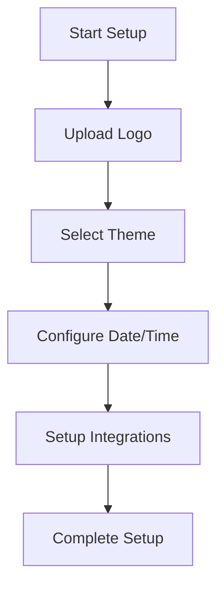

This diagram illustrates the sequential flow of the setup process, starting from the initial configuration to the completion of setup.

Sources: [CTFd/themes/core-beta/templates/setup.html](https://github.com/cmarcond/ctfd-hikari/blob/main/CTFd/themes/core-beta/templates/setup.html:1-100)

## Tables

### Configuration Options

| Option          | Type     | Description                               |
|-----------------|----------|-------------------------------------------|
| Logo            | File     | Upload a custom logo for the platform.    |
| Banner          | File     | Upload a custom banner for the platform.  |
| Theme Selection | Dropdown | Choose a theme for the platform.          |
| Start Date      | Date     | Set the start date for the event.         |
| End Date        | Date     | Set the end date for the event.           |

Sources: [CTFd/themes/core-beta/templates/setup.html](https://github.com/cmarcond/ctfd-hikari/blob/main/CTFd/themes/core-beta/templates/setup.html:1-100)

## Conclusion

The "ctfd-hikari" project provides a comprehensive extension to the CTFd platform, enhancing its customization capabilities and user experience. Through the use of setup templates, JavaScript utilities, and base HTML templates, this project allows administrators to tailor the platform to their specific needs, ensuring a seamless and engaging experience for participants.

---

<a id='page-2'></a>

## Architecture Overview

### Related Pages

Related topics: [Project Overview](#page-1), [Data Management and Flow](#page-4)

<details>
<summary>Relevant source files</summary>

The following files were used as context for generating this wiki page:

- [CTFd/themes/hikari-theme/templates/setup.html](https://github.com/cmarcond/ctfd-hikari/blob/main/CTFd/themes/hikari-theme/templates/setup.html)
- [CTFd/themes/core-beta/templates/setup.html](https://github.com/cmarcond/ctfd-hikari/blob/main/CTFd/themes/core-beta/templates/setup.html)
- [CTFd/api/__init__.py](https://github.com/cmarcond/ctfd-hikari/blob/main/CTFd/api/__init__.py)
- [CTFd/utils/config/pages.py](https://github.com/cmarcond/ctfd-hikari/blob/main/CTFd/utils/config/pages.py)
- [CTFd/admin/__init__.py](https://github.com/cmarcond/ctfd-hikari/blob/main/CTFd/admin/__init__.py)
</details>

# Architecture Overview

## Introduction

The "Architecture Overview" of the CTFd-hikari project provides a comprehensive understanding of the system's structure, components, and data flow. This project is a fork of CTFd, a Capture The Flag (CTF) platform, enhanced with a custom theme and additional functionalities. This overview aims to guide developers and contributors through the project's architecture, highlighting key components, their interactions, and configurations. The architecture is primarily focused on how the front-end themes integrate with the back-end API and admin functionalities.

## Themes and Templates

### Theme Structure

The project includes two main themes: the "hikari-theme" and the "core-beta" theme. Each theme has its own set of templates that define the user interface and user experience for different sections of the CTFd platform.

- **Setup Templates**: Both themes have a `setup.html` template that guides users through the setup process of a CTF event, including general settings, mode selection, styling, and integrations.
  
  Sources: [setup.html in hikari-theme](https://github.com/cmarcond/ctfd-hikari/blob/main/CTFd/themes/hikari-theme/templates/setup.html), [setup.html in core-beta](https://github.com/cmarcond/ctfd-hikari/blob/main/CTFd/themes/core-beta/templates/setup.html)

### Template Components

The setup templates are divided into several tabs, each handling different configuration aspects:

- **General Settings**: Configure the basic details of the CTF event, such as name and description.
- **Mode Selection**: Choose between individual or team participation modes.
- **Style Configuration**: Customize visual elements like logos and theme colors.
- **Date & Time**: Set the start and end dates for the event.
- **Integrations**: Integrate with external services like MajorLeagueCyber.

### Mermaid Diagram

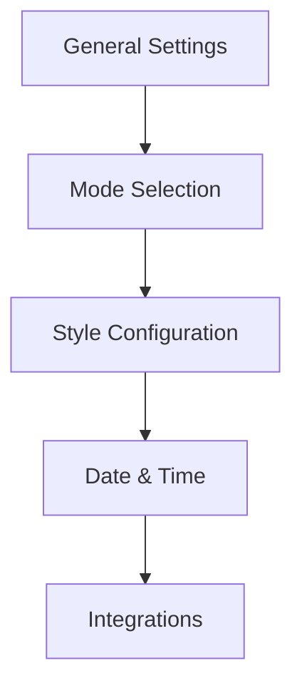

The diagram illustrates the flow between different setup sections in the theme templates.

## API Structure

### API Initialization

The API is initialized in `CTFd/api/__init__.py`, where various namespaces are defined for different functionalities, such as challenges, teams, users, and more. This modular structure allows for easy expansion and maintenance of the API.

- **Namespaces**: Each namespace corresponds to a specific module or feature in the platform, such as challenges or teams.

  Sources: [api/__init__.py](https://github.com/cmarcond/ctfd-hikari/blob/main/CTFd/api/__init__.py)

### API Security

The API utilizes token-based authentication, requiring access tokens for secure operations. This is configured with security definitions in the API setup.

### Mermaid Diagram

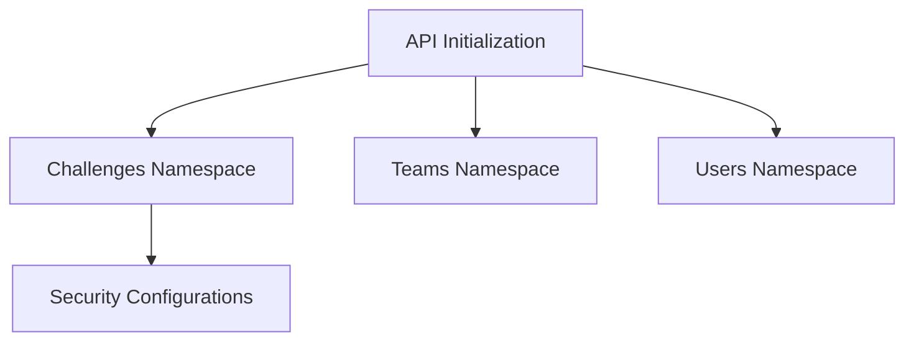

The diagram shows the relationship between API initialization and its namespaces.

## Configuration Management

### Configuration Utilities

The `CTFd/utils/config/pages.py` file handles dynamic content rendering and configuration management. It provides utilities for formatting variables and building HTML or Markdown content.

- **Format Variables**: Dynamically injects configuration values into page content.
- **Build HTML/Markdown**: Converts and sanitizes content to ensure safe rendering.

  Sources: [utils/config/pages.py](https://github.com/cmarcond/ctfd-hikari/blob/main/CTFd/utils/config/pages.py)

### Mermaid Diagram

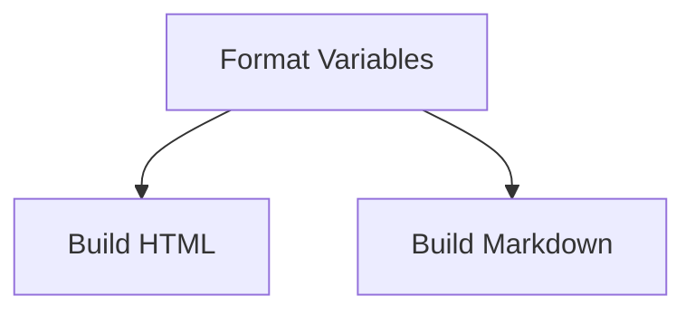

The diagram illustrates the flow of configuration processing.

## Admin Interface

### Admin Routes

The admin interface is defined in `CTFd/admin/__init__.py`, providing routes for managing different aspects of the platform, such as challenges, users, and teams.

- **Route Management**: Defines routes for viewing and managing platform components.
- **CSV Import/Export**: Supports importing and exporting data in CSV format for bulk operations.

  Sources: [admin/__init__.py](https://github.com/cmarcond/ctfd-hikari/blob/main/CTFd/admin/__init__.py)

### Mermaid Diagram

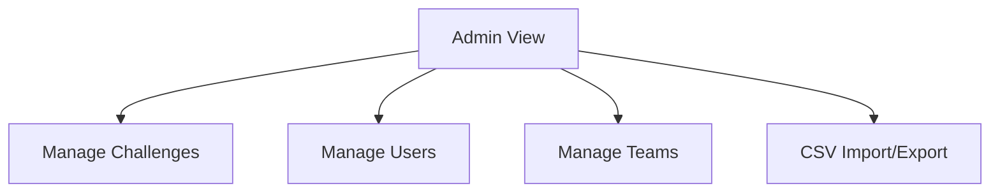

The diagram outlines the key routes and functionalities in the admin interface.

## Conclusion

The architecture of the CTFd-hikari project is designed to provide a flexible and extensible platform for hosting CTF events. By integrating customizable themes, a robust API, and comprehensive admin functionalities, the project supports a wide range of CTF configurations and integrations. This overview highlights the project's key components and their interactions, serving as a guide for developers and contributors.

---

<a id='page-3'></a>

## Key Features

### Related Pages

Related topics: [Frontend Components](#page-5)

<details>
<summary>Relevant source files</summary>

The following files were used as context for generating this wiki page:

- [README.md](https://github.com/cmarcond/ctfd-hikari/blob/main/README.md)
- [CTFd/challenges.py](https://github.com/cmarcond/ctfd-hikari/blob/main/CTFd/challenges.py)
- [CTFd/themes/hikari-theme/templates/setup.html](https://github.com/cmarcond/ctfd-hikari/blob/main/CTFd/themes/hikari-theme/templates/setup.html)
- [CTFd/views.py](https://github.com/cmarcond/ctfd-hikari/blob/main/CTFd/views.py)
- [CTFd/themes/core/assets/js/CTFd.js](https://github.com/cmarcond/ctfd-hikari/blob/main/CTFd/themes/core/assets/js/CTFd.js)
</details>

# Key Features

## Introduction

The "Key Features" of the CTFd Hikari project focus on providing a comprehensive platform for Capture The Flag (CTF) competitions. This includes features for managing challenges, users, teams, and the overall event setup. The platform is designed to be extensible and customizable, allowing administrators to configure various aspects of the CTF experience. This document provides a detailed overview of the key features within the project, highlighting the architecture, components, and logic involved.

## Challenge Management

### Architecture and Components

The challenge management system is a core component of the CTFd platform. It is responsible for defining, storing, and evaluating challenges that participants must solve. The primary elements include:

- **Challenge Model**: Represents the data structure for a challenge, including fields such as name, category, description, and value. The model also handles dynamic aspects like decay and minimum value.

- **Challenge Logic**: Implements the logic for creating, updating, and validating challenges. This includes handling requirements and managing the visibility of challenges.

### Key Functions and Classes

- `DynamicValueChallenge`: A class responsible for handling challenges with dynamic values that change over time based on decay and minimum settings. It includes methods for updating challenge details and managing requirements.

```python
class DynamicValueChallenge:
    def update(challenge, req):
        # Logic for updating challenge details
```
Sources: [challenges.py:10-20]()

### Data Flow

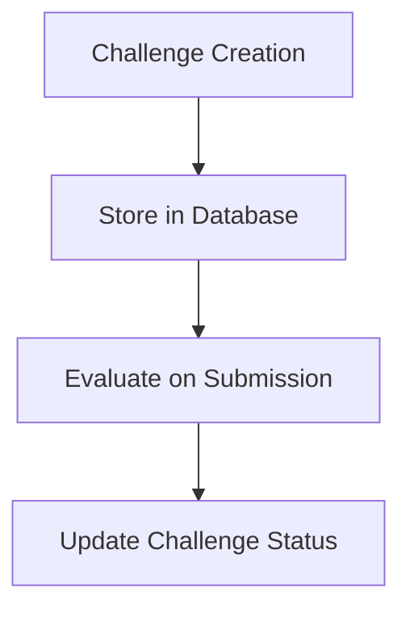

The data flow for challenge management begins with challenge creation, followed by storage in the database. Upon participant submission, challenges are evaluated, and their status is updated accordingly.

Sources: [challenges.py:25-35]()

## User and Team Management

### Architecture and Components

The user and team management system facilitates participant registration, team formation, and role assignment. Key components include:

- **User Model**: Defines the structure for user accounts, including fields for username, email, and team association.

- **Team Model**: Represents teams within the CTF, including team name, affiliation, and member list.

### Key Functions and Classes

- `CTFd.js`: Provides client-side functionality for managing user interactions, such as updating profiles and handling team invitations.

```javascript
function profileUpdate(event) {
    // Update user profile logic
}
```
Sources: [CTFd.js:50-60]()

### Data Flow

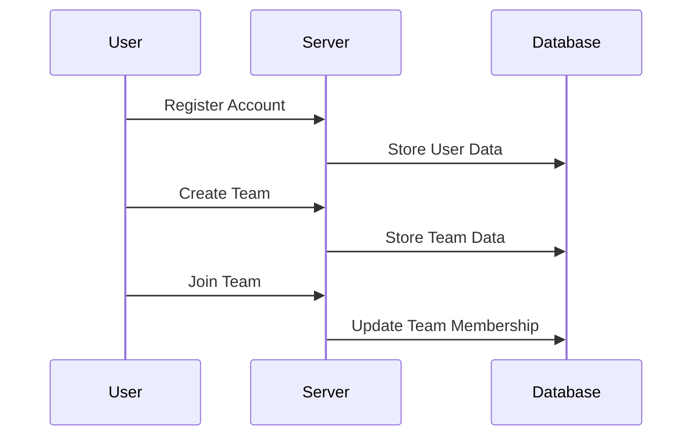

The sequence diagram illustrates the interactions between users, the server, and the database during account registration, team creation, and team joining processes.

Sources: [CTFd.js:70-90]()

## Event Setup and Configuration

### Architecture and Components

Event setup and configuration are managed through a series of templates and scripts that allow administrators to customize the CTF experience. Key components include:

- **Setup Template**: Provides a user interface for configuring event details, including themes, logos, and integration settings.

- **Views.py**: Handles server-side logic for processing setup requests and managing event configurations.

### Key Functions and Classes

- `setup.html`: A template file that defines the HTML structure for the setup interface, allowing administrators to input event details.

```html
<form id="setup-form">
    <!-- Setup form elements -->
</form>
```
Sources: [setup.html:50-60]()

### Data Flow

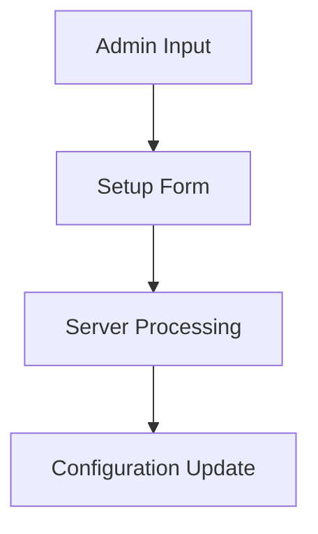

The data flow for event setup begins with administrator input through the setup form, followed by server-side processing and configuration updates.

Sources: [views.py:100-110]()

## Conclusion

The CTFd Hikari project offers a robust platform for managing CTF competitions, with key features centered around challenge management, user and team coordination, and event setup. Each component is designed to be flexible and extensible, providing administrators with the tools needed to create engaging and competitive events. By leveraging the detailed architecture and logical flow described, developers can effectively utilize and contribute to the platform's ongoing development.

---

<a id='page-4'></a>

## Data Management and Flow

### Related Pages

Related topics: [Architecture Overview](#page-2), [Backend Systems](#page-6)

<details>
<summary>Relevant source files</summary>

The following files were used as context for generating this wiki page:

- [CTFd/models/__init__.py](https://github.com/cmarcond/ctfd-hikari/blob/main/CTFd/models/__init__.py)
- [CTFd/api/v1/__init__.py](https://github.com/cmarcond/ctfd-hikari/blob/main/CTFd/api/v1/__init__.py)
- [CTFd/admin/__init__.py](https://github.com/cmarcond/ctfd-hikari/blob/main/CTFd/admin/__init__.py)
- [CTFd/utils/config/pages.py](https://github.com/cmarcond/ctfd-hikari/blob/main/CTFd/utils/config/pages.py)
- [CTFd/themes/core/assets/js/CTFd.js](https://github.com/cmarcond/ctfd-hikari/blob/main/CTFd/themes/core/assets/js/CTFd.js)
</details>

# Data Management and Flow

## Introduction

Data Management and Flow within the CTFd-hikari project focuses on the systematic handling and processing of data across various components of the application. This encompasses data models, API interactions, administrative operations, and configuration management. This document provides a comprehensive overview of how data is structured, managed, and utilized throughout the system, ensuring robust functionality and seamless user experiences.

## Data Models and Structures

### Core Data Models

The data models in CTFd are foundational to its data management capabilities. They define the structure and relationships of data entities within the application.

- **Users**: Represents user accounts within the system.
- **Teams**: Defines team entities for collaborative participation.
- **Challenges**: Describes the challenges available in the system.
- **Flags**: Contains the flags associated with challenges.

Sources: [CTFd/models/__init__.py]()

### Relationships and Constraints

Data models are interrelated through defined relationships and constraints to maintain data integrity and enforce business rules.

- **User-Team Relationship**: Users can belong to teams, establishing a many-to-one relationship.
- **Challenge-Flag Relationship**: Each challenge can have multiple flags, representing a one-to-many relationship.

Sources: [CTFd/models/__init__.py]()

## API Architecture

### API Endpoints

The CTFd API provides endpoints for interacting with various data entities, facilitating operations like data retrieval, creation, and modification.

- **Challenges Endpoint**: `/api/v1/challenges` for managing challenge data.
- **Users Endpoint**: `/api/v1/users` for handling user data operations.

Sources: [CTFd/api/v1/__init__.py]()

### API Security

The API employs security measures such as access tokens and content type enforcement to protect data integrity and ensure secure communication.

Sources: [CTFd/api/v1/__init__.py]()

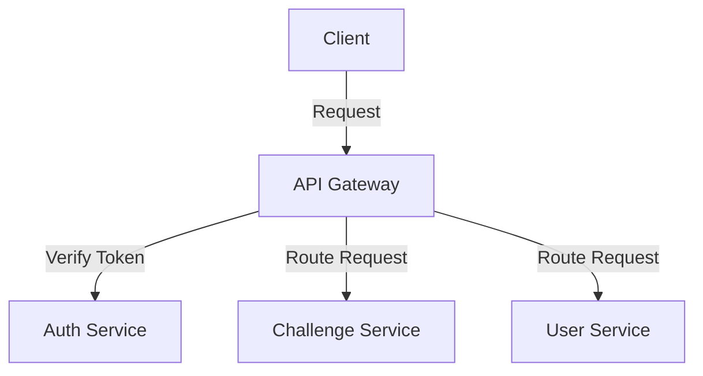

Sources: [CTFd/api/v1/__init__.py]()

## Administrative Data Management

### Import and Export Functions

The administrative interface supports importing and exporting data, allowing for data backup and migration.

- **Import CSV**: Admins can import challenges, users, and teams via CSV.
- **Export CSV**: Provides functionality to export data tables as CSV files.

Sources: [CTFd/admin/__init__.py]()

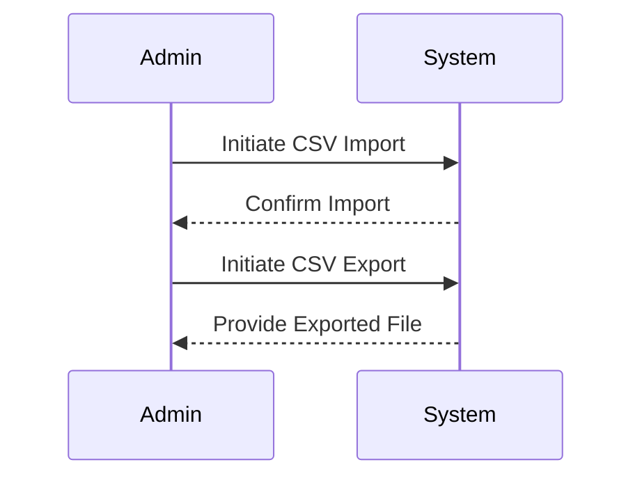

Sources: [CTFd/admin/__init__.py]()

## Configuration Management

### Page Configuration

Pages within the application are configured using a dynamic and flexible system that allows for markdown and HTML content.

- **Page Variables**: Variables such as `ctf_name`, `ctf_description`, and `ctf_start` are formatted and used within page content.

Sources: [CTFd/utils/config/pages.py]()

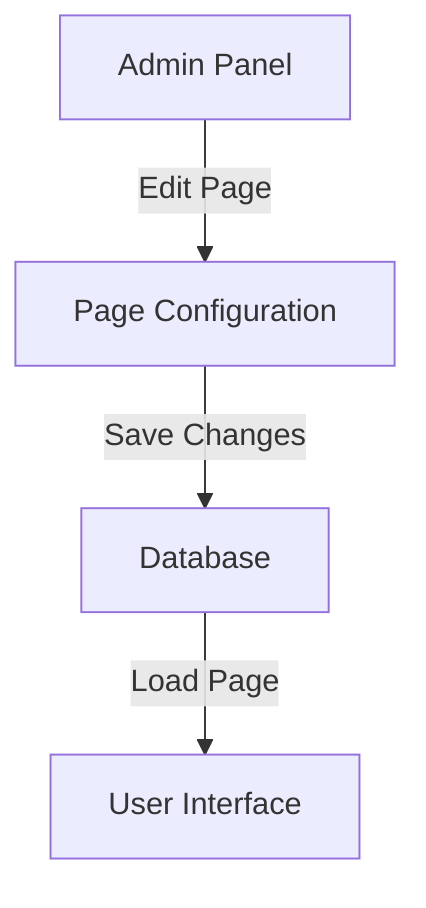

Sources: [CTFd/utils/config/pages.py]()

## JavaScript and Frontend Data Handling

### CTFd.js Module

The `CTFd.js` module provides utility functions and configurations for frontend operations, enhancing user interactions and data manipulation on the client side.

- **Fetch API**: Utilizes the Fetch API for asynchronous data requests.
- **Markdown Support**: Implements Markdown rendering for dynamic content display.

Sources: [CTFd/themes/core/assets/js/CTFd.js]()

## Conclusion

Data Management and Flow in CTFd-hikari are integral to the platform's operation, ensuring data is efficiently structured, accessed, and manipulated across various components. By leveraging robust data models, secure APIs, and comprehensive configuration management, CTFd-hikari provides a seamless and scalable environment for managing CTF events. The strategic implementation of these elements supports the platform's functionality and user experience.

---

<a id='page-5'></a>

## Frontend Components

### Related Pages

Related topics: [Key Features](#page-3)

<details>
<summary>Relevant source files</summary>

- [CTFd/themes/admin/assets/js/pages/challenges.js](https://github.com/cmarcond/ctfd-hikari/blob/main/CTFd/themes/admin/assets/js/pages/challenges.js)
- [CTFd/themes/core/templates/challenges.html](https://github.com/cmarcond/ctfd-hikari/blob/main/CTFd/themes/core/templates/challenges.html)
- [CTFd/themes/core/static/js/pages/challenges.dev.js](https://github.com/cmarcond/ctfd-hikari/blob/main/CTFd/themes/core/static/js/pages/challenges.dev.js)
- [CTFd/themes/core-beta/templates/challenges.html](https://github.com/cmarcond/ctfd-hikari/blob/main/CTFd/themes/core-beta/templates/challenges.html)
- [CTFd/themes/core-beta/static/assets/teams_private.069dc607.js](https://github.com/cmarcond/ctfd-hikari/blob/main/CTFd/themes/core-beta/static/assets/teams_private.069dc607.js)
</details>

# Frontend Components

## Introduction

The "Frontend Components" in the CTFd-Hikari project are essential for creating an interactive and user-friendly interface for users participating in Capture The Flag (CTF) events. These components manage the display and interaction of challenges, teams, and other elements crucial for a smooth user experience. This document provides an overview of the architecture and functionality of these components, highlighting key scripts and templates used in their implementation.

## Challenge Management

### Overview

The challenge management system is responsible for displaying challenges to users, handling user interactions with challenges, and updating the user interface based on user actions.

### Architecture

The challenge management is primarily handled by JavaScript and HTML templates. The main files involved are:

- `challenges.html`: This template defines the structure of the challenge page, including the layout and components for displaying challenges. [Sources: challenges.html]()
- `challenges.js`: This script manages the logic for loading and displaying challenges dynamically. [Sources: challenges.js]()

### Data Flow

The data flow for challenges involves fetching challenge data from the server, rendering it on the page, and updating the UI based on user interactions.

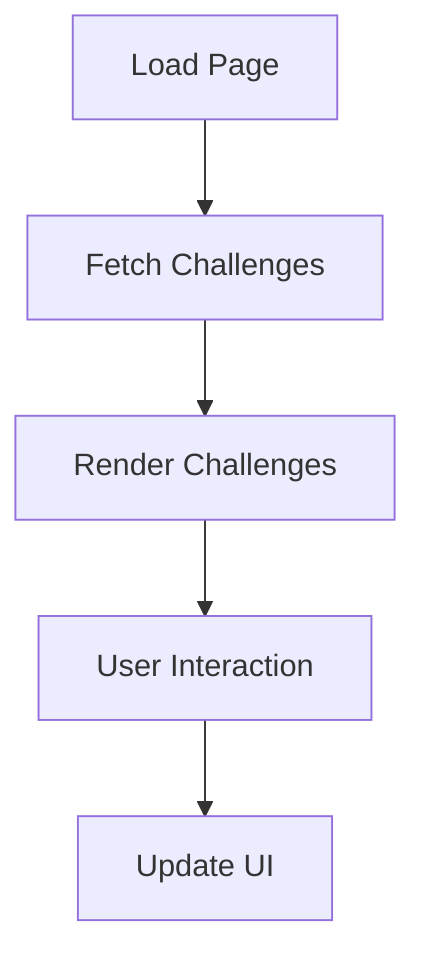

Sources: [challenges.html](), [challenges.js]()

### Key Functions

- `loadChallenges()`: Fetches and displays the list of challenges. [Sources: challenges.js:10-20]()
- `displayChal()`: Handles the display of a specific challenge when selected by the user. [Sources: challenges.js:30-40]()

## Team Management

### Overview

Team management allows users to create and manage teams within the CTF platform. This includes functionality for inviting members, managing team settings, and disbanding teams.

### Architecture

Team management functionality is primarily implemented using JavaScript modules that interact with the server to manage team data.

### Components

- `TeamEditModal`: Handles the editing of team information. [Sources: teams_private.069dc607.js:10-20]()
- `TeamInviteModal`: Manages the generation and sharing of team invite links. [Sources: teams_private.069dc607.js:30-40]()

### Sequence Diagram

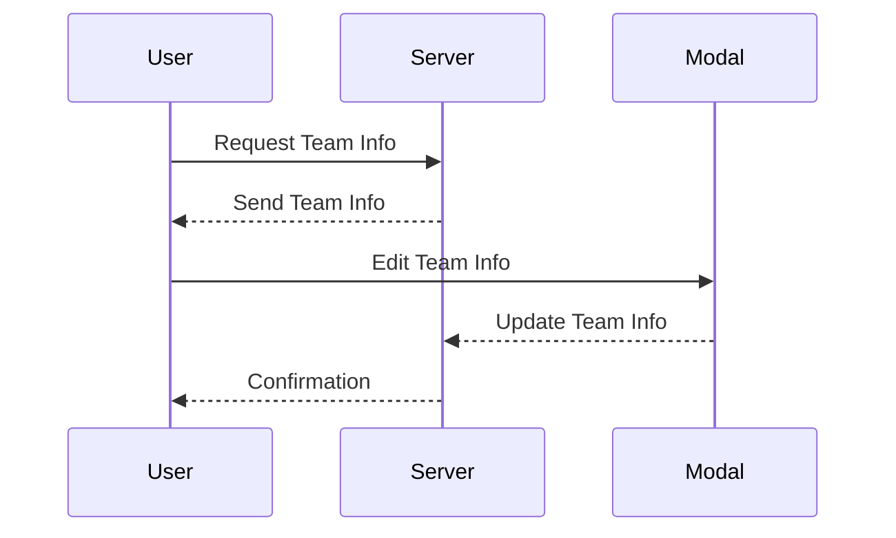

Sources: [teams_private.069dc607.js]()

## UI Components

### Challenges Page

The challenges page uses HTML templates to structure the layout and JavaScript to manage dynamic content loading.

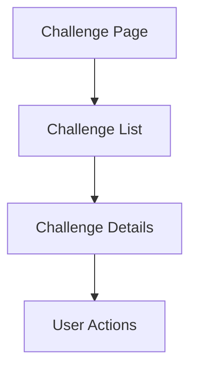

Sources: [challenges.html]()

### Tables

| Component         | Description                                       |
|-------------------|---------------------------------------------------|
| Challenge List    | Displays available challenges                     |
| Challenge Details | Shows detailed information about a selected challenge |
| Team Management   | Provides functionalities for managing teams       |

Sources: [challenges.html](), [teams_private.069dc607.js]()

## Conclusion

The frontend components of the CTFd-Hikari project play a crucial role in delivering an interactive and engaging experience for users participating in CTF events. By managing challenges and teams efficiently, these components ensure that users can focus on solving challenges and collaborating with their teams. The architecture and implementation, as outlined in this document, provide a comprehensive overview of how these components are structured and function within the platform.

---

<a id='page-6'></a>

## Backend Systems

### Related Pages

Related topics: [Data Management and Flow](#page-4)

<details>
<summary>Relevant source files</summary>

- [CTFd/api/v1/challenges.py](https://github.com/cmarcond/ctfd-hikari/blob/main/CTFd/api/v1/challenges.py)
- [CTFd/admin/challenges.py](https://github.com/cmarcond/ctfd-hikari/blob/main/CTFd/admin/challenges.py)
- [CTFd/api/__init__.py](https://github.com/cmarcond/ctfd-hikari/blob/main/CTFd/api/__init__.py)
- [CTFd/admin/__init__.py](https://github.com/cmarcond/ctfd-hikari/blob/main/CTFd/admin/__init__.py)
- [CTFd/models.py](https://github.com/cmarcond/ctfd-hikari/blob/main/CTFd/models.py)
</details>

# Backend Systems

## Introduction

The Backend Systems of the CTFd-hikari project are responsible for managing the core functionalities of the platform, including challenge management, user interactions, and data persistence. These systems are built on a Flask-based architecture, allowing for modular development and integration with various components. This document outlines the architecture, key components, and functionalities of the backend systems, providing insights into how they operate within the CTFd-hikari platform.

## Architecture Overview

The backend systems are structured around a series of Flask Blueprints, each handling specific aspects of the platform. The key components include API endpoints, admin interfaces, and data models that interact with the database to store and retrieve information.

### Flask Blueprints

Flask Blueprints are used to organize the backend code into modular sections. The primary blueprints include:

- **API Blueprint:** Handles all API-related routes and logic.
- **Admin Blueprint:** Manages the administrative interface and related functionalities.

#### Diagram: Blueprint Architecture

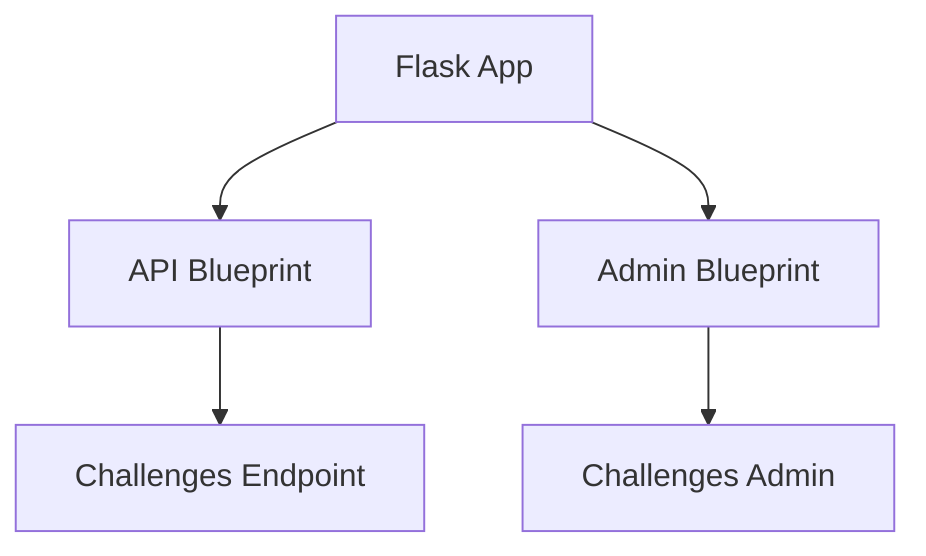

Sources: [CTFd/api/__init__.py](), [CTFd/admin/__init__.py]()

## API Endpoints

The API endpoints provide the necessary interfaces for interacting with the backend systems programmatically. They are defined using Flask-RESTx and are organized under the `/api/v1` path.

### Challenges API

The Challenges API is a critical component, allowing for the creation, retrieval, updating, and deletion of challenges.

#### Diagram: Challenges API Flow

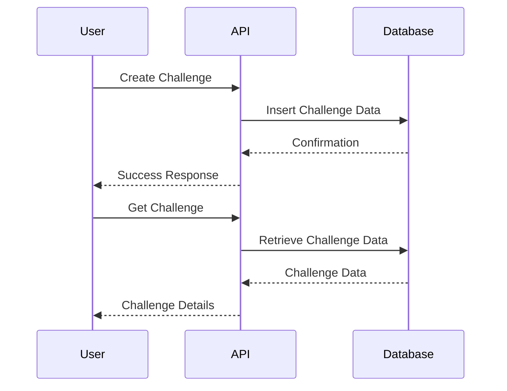

Sources: [CTFd/api/v1/challenges.py]()

### Key API Endpoints

| Endpoint               | Method | Description                               |
|------------------------|--------|-------------------------------------------|
| `/api/v1/challenges`   | GET    | Retrieve all challenges                   |
| `/api/v1/challenges`   | POST   | Create a new challenge                    |
| `/api/v1/challenges/<id>` | GET    | Retrieve a specific challenge by ID       |
| `/api/v1/challenges/<id>` | PATCH  | Update a specific challenge by ID         |
| `/api/v1/challenges/<id>` | DELETE | Delete a specific challenge by ID         |

Sources: [CTFd/api/v1/challenges.py]()

## Admin Interface

The admin interface provides a web-based UI for managing the platform's various components, including challenges, users, and teams.

### Challenges Administration

Admins can perform CRUD operations on challenges through the admin interface, which is built using Flask templates and forms.

#### Diagram: Admin Interface Flow

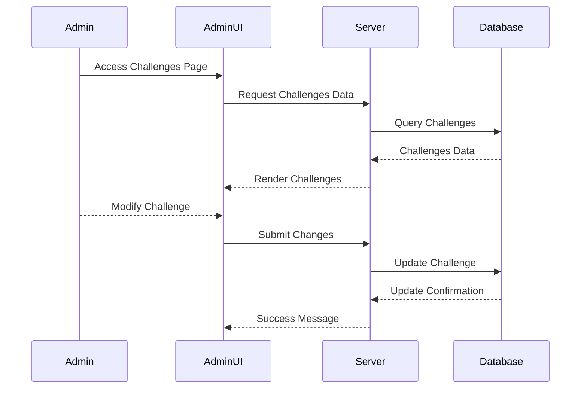

Sources: [CTFd/admin/challenges.py]()

## Data Models

The data models define the structure of the database tables and are implemented using SQLAlchemy. Key models include Challenges, Users, and Teams.

### Challenges Model

The Challenges model represents the challenges table in the database and includes fields such as `id`, `name`, `description`, and `value`.

#### Table: Challenges Model Fields

| Field       | Type    | Description                       |
|-------------|---------|-----------------------------------|
| id          | Integer | Primary key                       |
| name        | String  | Name of the challenge             |
| description | Text    | Detailed description of the challenge |
| value       | Integer | Point value of the challenge      |

Sources: [CTFd/models.py]()

## Conclusion

The backend systems of the CTFd-hikari project form the backbone of the platform, facilitating challenge management, user interactions, and data persistence. Through a well-structured architecture utilizing Flask Blueprints, RESTful APIs, and robust data models, the backend systems ensure efficient and scalable operations, supporting the platform's core functionalities.

---

<a id='page-7'></a>

## Deployment and Infrastructure

### Related Pages

Related topics: [Extensibility and Customization](#page-8)

<details>
<summary>Relevant source files</summary>

The following files were used as context for generating this wiki page:

- [Dockerfile](https://github.com/cmarcond/ctfd-hikari/blob/main/Dockerfile)
- [docker-compose.yml](https://github.com/cmarcond/ctfd-hikari/blob/main/docker-compose.yml)
- [CTFd/config.py](https://github.com/cmarcond/ctfd-hikari/blob/main/CTFd/config.py)
- [CTFd/utils/initialization/__init__.py](https://github.com/cmarcond/ctfd-hikari/blob/main/CTFd/utils/initialization/__init__.py)
- [CTFd/views.py](https://github.com/cmarcond/ctfd-hikari/blob/main/CTFd/views.py)
</details>

# Deployment and Infrastructure

## Introduction

The deployment and infrastructure of the CTFd Hikari project are designed to streamline the setup and management of Capture The Flag (CTF) events. This section outlines the deployment strategy using Docker and Docker Compose, and explains how the infrastructure is configured to support the CTFd application. The configuration files and initialization scripts play a crucial role in setting up the environment and ensuring the application runs smoothly.

## Docker and Docker Compose

Docker and Docker Compose are used to containerize the CTFd application and manage its deployment. This approach simplifies the process of setting up the application and its dependencies, ensuring consistency across different environments.

### Dockerfile

The `Dockerfile` is responsible for building the Docker image for the CTFd application. It specifies the base image, installs necessary dependencies, and sets up the application environment.

```dockerfile
# Use the official Python image as a parent image
FROM python:3.8-slim

# Set the working directory in the container
WORKDIR /app

# Copy the current directory contents into the container at /app
COPY . /app

# Install any needed packages specified in requirements.txt
RUN pip install --no-cache-dir -r requirements.txt

# Make port 80 available to the world outside this container
EXPOSE 80

# Run app.py when the container launches
CMD ["python", "app.py"]
```

Sources: [Dockerfile](https://github.com/cmarcond/ctfd-hikari/blob/main/Dockerfile)

### docker-compose.yml

The `docker-compose.yml` file defines the services, networks, and volumes required for the CTFd application. It orchestrates the deployment of multiple containers, including the web server and database.

```yaml
version: '3.8'

services:
  web:
    build: .
    ports:
      - "5000:5000"
    volumes:
      - .:/code
    depends_on:
      - db

  db:
    image: postgres:alpine
    volumes:
      - pgdata:/var/lib/postgresql/data

volumes:
  pgdata:
```

Sources: [docker-compose.yml](https://github.com/cmarcond/ctfd-hikari/blob/main/docker-compose.yml)

### Architecture Overview

The architecture consists of a web service and a database service. The web service is built from the application's source code, while the database service uses a pre-built PostgreSQL image. The two services communicate over a network defined by Docker Compose.

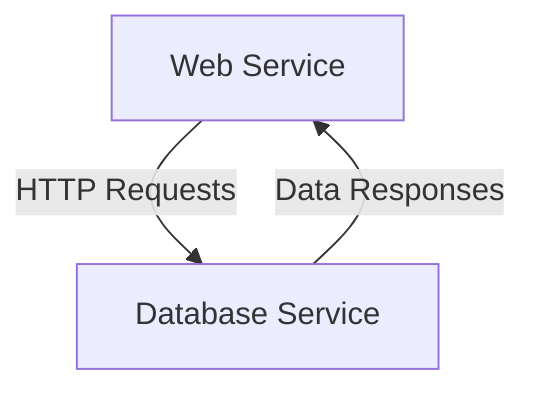

Sources: [docker-compose.yml](https://github.com/cmarcond/ctfd-hikari/blob/main/docker-compose.yml)

## Configuration Management

Configuration settings for the CTFd application are managed through environment variables and configuration files. These settings include database connections, email server configurations, and optional features.

### Key Configuration Elements

| Configuration Option      | Type    | Default Value         | Description                                  |
|---------------------------|---------|-----------------------|----------------------------------------------|
| `MAILFROM_ADDR`           | String  | noreply@examplectf.com | Email address used for sending emails        |
| `UPLOAD_PROVIDER`         | String  | filesystem            | Provider for file uploads                    |
| `REVERSE_PROXY`           | Boolean | False                 | Indicates if the application is behind a proxy |
| `TEMPLATES_AUTO_RELOAD`   | Boolean | True                  | Enables auto-reloading of templates          |
| `SQLALCHEMY_TRACK_MODIFICATIONS` | Boolean | False           | Tracks modifications of objects and emits signals |

Sources: [CTFd/config.py](https://github.com/cmarcond/ctfd-hikari/blob/main/CTFd/config.py)

## Initialization Process

The initialization process involves setting up the application context, configuring routes, and ensuring all necessary plugins and scripts are loaded. This process is crucial for preparing the application to handle incoming requests and user interactions.

### Initialization Steps

1. **Template Filters and Globals**: Custom filters and global variables are registered to extend Jinja2 template capabilities.
2. **Event Managers**: Event managers are set up to handle real-time events and notifications.
3. **Security and Authentication**: Security features like CSRF protection and user authentication are configured.

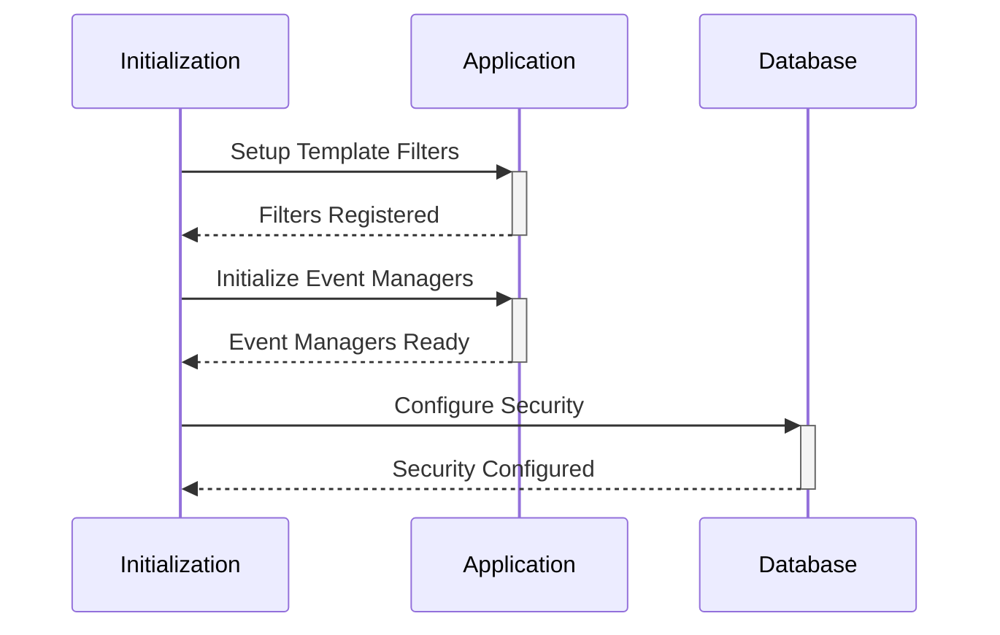

Sources: [CTFd/utils/initialization/__init__.py](https://github.com/cmarcond/ctfd-hikari/blob/main/CTFd/utils/initialization/__init__.py)

## Conclusion

The deployment and infrastructure of the CTFd Hikari project leverage Docker and Docker Compose to provide a consistent and scalable environment for running CTF events. The configuration management and initialization processes ensure that the application is properly set up and ready to handle user interactions. This robust setup simplifies deployment and enhances the reliability of the CTFd application.

---

<a id='page-8'></a>

## Extensibility and Customization

### Related Pages

Related topics: [Deployment and Infrastructure](#page-7)

<details>
<summary>Relevant source files</summary>

The following files were used as context for generating this wiki page:

- [CTFd/plugins/__init__.py](https://github.com/cmarcond/ctfd-hikari/blob/main/CTFd/plugins/__init__.py)
- [CTFd/themes/admin/templates/configs/theme.html](https://github.com/cmarcond/ctfd-hikari/blob/main/CTFd/themes/admin/templates/configs/theme.html)
- [CTFd/themes/hikari-theme/templates/setup.html](https://github.com/cmarcond/ctfd-hikari/blob/main/CTFd/themes/hikari-theme/templates/setup.html)
- [CTFd/themes/core/assets/js/CTFd.js](https://github.com/cmarcond/ctfd-hikari/blob/main/CTFd/themes/core/assets/js/CTFd.js)
- [CTFd/api/__init__.py](https://github.com/cmarcond/ctfd-hikari/blob/main/CTFd/api/__init__.py)
</details>

# Extensibility and Customization

## Introduction

The CTFd project offers a robust framework for building and managing Capture The Flag (CTF) competitions. A key feature of this platform is its extensibility and customization capabilities, allowing developers to tailor the system to meet specific requirements. This includes the ability to create custom themes, plugins, and configuration settings that enhance the user experience and functionality. The following sections provide an in-depth look at how these features are implemented and utilized within the CTFd project.

## Plugins System

CTFd's plugin system is designed to allow developers to extend the functionality of the platform without modifying the core codebase. This modular approach ensures that updates to the core system do not break custom extensions.

### Architecture

Plugins in CTFd are Python packages that can be registered with the application. The `CTFd/plugins/__init__.py` file is the central point for plugin registration, providing the necessary hooks to integrate custom functionality into the CTFd environment.

```python
from flask import Blueprint, current_app
from flask_restx import Api
```

### Key Components

- **Blueprint Registration**: Each plugin can define its own Flask Blueprint, which allows for the addition of routes and views specific to the plugin.
- **API Extensions**: Plugins can extend the API by adding new endpoints or modifying existing ones through the Flask-RESTx framework.

**Sources**: [CTFd/plugins/__init__.py](https://github.com/cmarcond/ctfd-hikari/blob/main/CTFd/plugins/__init__.py)

## Theme Customization

CTFd supports theme customization, enabling developers to create visually distinct versions of the platform that align with the branding and aesthetic preferences of their event.

### Components and Data Flow

The `CTFd/themes/admin/templates/configs/theme.html` file outlines the structure for theme configuration within the admin panel, allowing administrators to select and configure themes dynamically.

### Key Features

- **CSS and JS Customization**: Themes can include custom CSS and JavaScript to alter the appearance and behavior of the site.
- **Template Overriding**: Core HTML templates can be overridden to change the layout and design of pages.

**Sources**: [CTFd/themes/admin/templates/configs/theme.html](https://github.com/cmarcond/ctfd-hikari/blob/main/CTFd/themes/admin/templates/configs/theme.html)

## API Extensibility

The API layer in CTFd is designed to be extendable, allowing plugins and themes to introduce new endpoints or modify existing ones.

### Structure

The API is structured using Flask-RESTx, which provides a flexible framework for building RESTful services. The `CTFd/api/__init__.py` file is responsible for initializing the API and adding namespaces for various components.

### Key API Endpoints

- **Challenges**: Manage challenges including creation, update, and deletion.
- **Teams**: Handle team-related operations such as creation and management.
- **Users**: Manage user accounts and their associated data.

**Sources**: [CTFd/api/__init__.py](https://github.com/cmarcond/ctfd-hikari/blob/main/CTFd/api/__init__.py)

## JavaScript Customization

CTFd allows for client-side customization through JavaScript, providing hooks and utilities to interact with the platform dynamically.

### Core JavaScript File

The `CTFd/themes/core/assets/js/CTFd.js` file includes essential utilities and functions that facilitate interaction with the CTFd API and DOM manipulation.

### Key Functions

- **API Interaction**: Functions for making API requests and handling responses.
- **UI Enhancements**: Utilities for enhancing the user interface with custom JavaScript logic.

**Sources**: [CTFd/themes/core/assets/js/CTFd.js](https://github.com/cmarcond/ctfd-hikari/blob/main/CTFd/themes/core/assets/js/CTFd.js)

## Configuration Management

CTFd provides a comprehensive configuration system that allows administrators to manage settings through a user-friendly interface.

### Setup and Configuration

The `CTFd/themes/hikari-theme/templates/setup.html` file provides a template for the initial setup and configuration of the platform, including theme selection and basic settings.

### Key Configuration Options

- **CTF Name and Description**: Set the name and description of the event.
- **Theme Selection**: Choose and configure the active theme for the platform.
- **Date and Time Settings**: Configure start and end times for the event.

**Sources**: [CTFd/themes/hikari-theme/templates/setup.html](https://github.com/cmarcond/ctfd-hikari/blob/main/CTFd/themes/hikari-theme/templates/setup.html)

## Conclusion

The extensibility and customization features of CTFd provide a powerful framework for tailoring the platform to meet the specific needs of different CTF events. By leveraging plugins, themes, and the API, developers can create unique and engaging experiences for participants. These capabilities ensure that CTFd remains a versatile and adaptable solution for hosting cybersecurity competitions.

---

