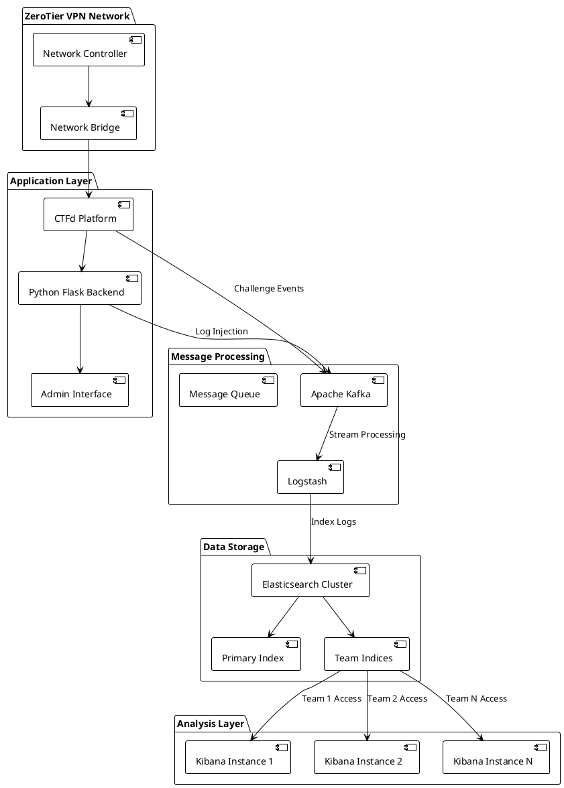
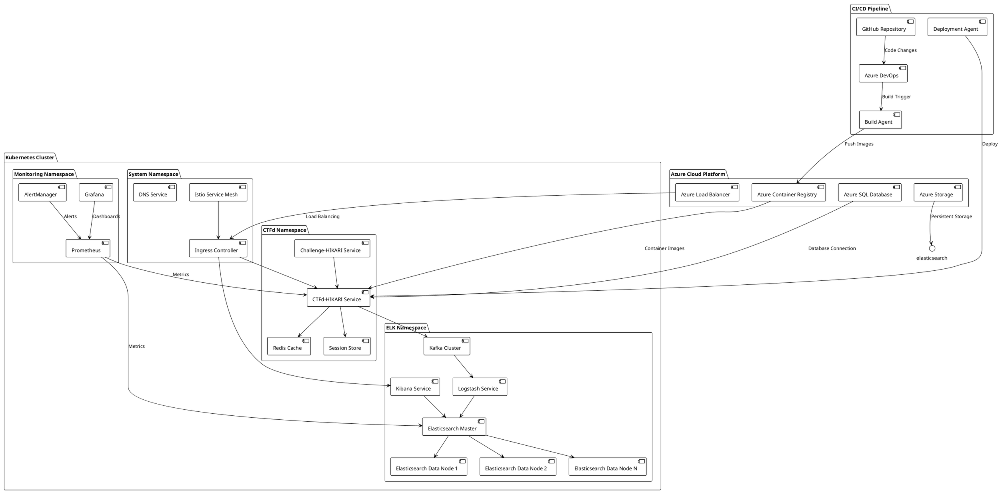
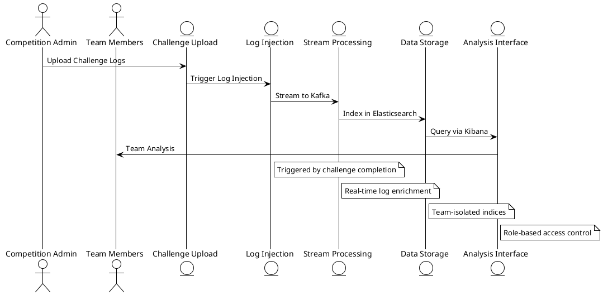
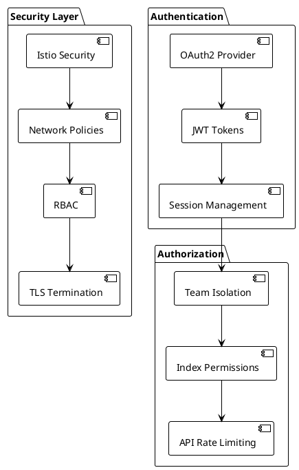

# Diagrams Directory Documentation

## Overview

The diagrams directory contains architectural diagrams and system documentation using PlantUML format. These diagrams provide technical blueprints for deploying and understanding the HIKARI platform's infrastructure, showing how all components interact in both development and production environments.

## Directory Structure

```
diagrams/
├── README.md           # Brief description of diagram contents
├── backend.plantuml    # Backend system architecture
└── hikari.plantuml     # Kubernetes deployment architecture
```

## 1. Backend Architecture (`backend.plantuml`)

### System Overview

The backend diagram illustrates the core HIKARI platform architecture with emphasis on network isolation, log processing, and multi-tenant analysis environments.

### Key Components

**Network Layer**:


### Component Details

**ZeroTier VPN Network**:
- **Purpose**: Secure network isolation for teams
- **Function**: Provides isolated network segments for each team
- **Integration**: Connects to CTFd for automatic network provisioning

**CTFd Platform**:
- **Modified CTFd**: Extended with HIKARI-specific plugins
- **Challenge Management**: Handles Blue Team log analysis challenges
- **Team Coordination**: Manages team registration and progress tracking

**Python Flask Backend**:
- **API Services**: RESTful endpoints for platform management
- **Log Processing**: Handles log file uploads and processing
- **Team Management**: Automates team provisioning and configuration

**Apache Kafka**:
- **Event Streaming**: Real-time log event processing
- **Topic Management**: Separate topics for different data types
- **Scalability**: Handles high-volume log streaming

**Logstash**:
- **Data Transformation**: Processes and enriches log data
- **Multiple Inputs**: Kafka, file uploads, API endpoints
- **Output Routing**: Directs processed logs to appropriate Elasticsearch indices

**Elasticsearch Cluster**:
- **Distributed Storage**: Scalable log storage and indexing
- **Team Isolation**: Separate indices for each team
- **Search Capabilities**: Full-text search and analytics

**Multi-tenant Kibana**:
- **Isolated Instances**: Each team has dedicated Kibana access
- **Custom Dashboards**: Pre-configured analysis dashboards
- **Role-based Access**: Team-specific data access controls

## 2. Kubernetes Deployment (`hikari.plantuml`)

### Production Architecture

The Kubernetes diagram shows the comprehensive deployment architecture for production HIKARI environments, including cloud integration and CI/CD pipelines.

### Infrastructure Components

**Azure Cloud Integration**:


### Namespace Architecture

**System Namespace**:
- **Istio Service Mesh**: Traffic management and security
- **Ingress Controller**: External traffic routing
- **DNS Service**: Service discovery and name resolution

**ELK Namespace**:
- **Elasticsearch Cluster**: Multi-node setup with master/data separation
- **Kibana Service**: Web interface for log analysis
- **Logstash Service**: Log processing and transformation
- **Kafka Cluster**: Message streaming and event processing

**CTFd Namespace**:
- **CTFd-HIKARI Service**: Modified CTFd application
- **Challenge-HIKARI Service**: Challenge management microservice
- **Redis Cache**: Session and data caching
- **Session Store**: User session management

**Monitoring Namespace**:
- **Prometheus**: Metrics collection and storage
- **Grafana**: Visualization and dashboards
- **AlertManager**: Alert processing and notifications

### Deployment Specifications

**Elasticsearch Configuration**:
```yaml
apiVersion: apps/v1
kind: StatefulSet
metadata:
  name: elasticsearch-master
  namespace: elk
spec:
  serviceName: elasticsearch-master
  replicas: 3
  template:
    spec:
      containers:
      - name: elasticsearch
        image: docker.elastic.co/elasticsearch/elasticsearch:7.17.10
        env:
        - name: cluster.name
          value: "hikari-cluster"
        - name: node.roles
          value: "master,ingest"
        - name: discovery.seed_hosts
          value: "elasticsearch-master"
        - name: cluster.initial_master_nodes
          value: "es-master-0,es-master-1,es-master-2"
        resources:
          requests:
            memory: 2Gi
            cpu: 1000m
          limits:
            memory: 4Gi
            cpu: 2000m
        volumeMounts:
        - name: data
          mountPath: /usr/share/elasticsearch/data
  volumeClaimTemplates:
  - metadata:
      name: data
    spec:
      accessModes: ["ReadWriteOnce"]
      resources:
        requests:
          storage: 50Gi
      storageClassName: "managed-csi"
```

**CTFd-HIKARI Configuration**:
```yaml
apiVersion: apps/v1
kind: Deployment
metadata:
  name: ctfd-hikari
  namespace: ctfd
spec:
  replicas: 3
  selector:
    matchLabels:
      app: ctfd-hikari
  template:
    metadata:
      labels:
        app: ctfd-hikari
    spec:
      containers:
      - name: ctfd-hikari
        image: secdevias/hikari-ctfd:latest
        env:
        - name: DATABASE_URL
          valueFrom:
            secretKeyRef:
              name: database-secret
              key: url
        - name: REDIS_URL
          value: "redis://redis:6379"
        - name: KAFKA_BOOTSTRAP_SERVERS
          value: "kafka:9092"
        - name: ELASTICSEARCH_URL
          value: "http://elasticsearch-master:9200"
        ports:
        - containerPort: 8000
        resources:
          requests:
            memory: 1Gi
            cpu: 500m
          limits:
            memory: 2Gi
            cpu: 1000m
        livenessProbe:
          httpGet:
            path: /healthcheck
            port: 8000
          initialDelaySeconds: 30
          periodSeconds: 10
        readinessProbe:
          httpGet:
            path: /ready
            port: 8000
          initialDelaySeconds: 5
          periodSeconds: 5
```

### Service Mesh Configuration

**Istio Gateway**:
```yaml
apiVersion: networking.istio.io/v1beta1
kind: Gateway
metadata:
  name: hikari-gateway
  namespace: ctfd
spec:
  selector:
    istio: ingressgateway
  servers:
  - port:
      number: 443
      name: https
      protocol: HTTPS
    tls:
      mode: SIMPLE
      credentialName: hikari-tls-cert
    hosts:
    - "hikari.secdevias.com"
  - port:
      number: 80
      name: http
      protocol: HTTP
    hosts:
    - "hikari.secdevias.com"
    redirect:
      httpsRedirect: true
```

**Virtual Service**:
```yaml
apiVersion: networking.istio.io/v1beta1
kind: VirtualService
metadata:
  name: hikari-virtualservice
  namespace: ctfd
spec:
  hosts:
  - "hikari.secdevias.com"
  gateways:
  - hikari-gateway
  http:
  - match:
    - uri:
        prefix: "/kibana"
    route:
    - destination:
        host: kibana
        port:
          number: 5601
    headers:
      request:
        add:
          X-Forwarded-Proto: "https"
  - match:
    - uri:
        prefix: "/"
    route:
    - destination:
        host: ctfd-hikari
        port:
          number: 8000
```

## 3. Data Flow Architecture

### Log Processing Pipeline



### Security Architecture



## Usage Instructions

### Generating Diagrams

1. **Install PlantUML**:
   ```bash
   # Using Java
   wget http://sourceforge.net/projects/plantuml/files/plantuml.jar/download
   
   # Using package manager
   sudo apt-get install plantuml
   ```

2. **Generate SVG/PNG**:
   ```bash
   # Backend architecture
   plantuml -tsvg backend.plantuml
   
   # Kubernetes deployment
   plantuml -tpng hikari.plantuml
   ```

3. **View in Browser**:
   ```bash
   # Open generated files
   firefox backend.svg
   firefox hikari.png
   ```

### Customization

**Modify Components**:
- Edit `.plantuml` files to update architecture
- Add new components or connections
- Adjust styling and layouts

**Export Formats**:
- SVG: Vector graphics for documentation
- PNG: Raster images for presentations
- PDF: Print-ready documentation

## Architecture Benefits

### Scalability
- **Horizontal Scaling**: Add more Elasticsearch nodes
- **Load Distribution**: Istio load balancing
- **Auto-scaling**: Kubernetes HPA support

### Security
- **Network Isolation**: Istio service mesh
- **Data Segregation**: Team-specific indices
- **Authentication**: OAuth2 integration
- **Authorization**: Role-based access control

### Reliability
- **High Availability**: Multi-replica deployments
- **Fault Tolerance**: Elasticsearch cluster redundancy
- **Monitoring**: Prometheus/Grafana integration
- **Disaster Recovery**: Automated backups

### Maintainability
- **Microservices**: Loosely coupled components
- **CI/CD Integration**: Automated deployments
- **Configuration Management**: Kubernetes manifests
- **Documentation**: PlantUML diagrams

These diagrams provide comprehensive technical documentation for the HIKARI platform architecture, enabling effective deployment, maintenance, and scaling of the Blue Team training environment.